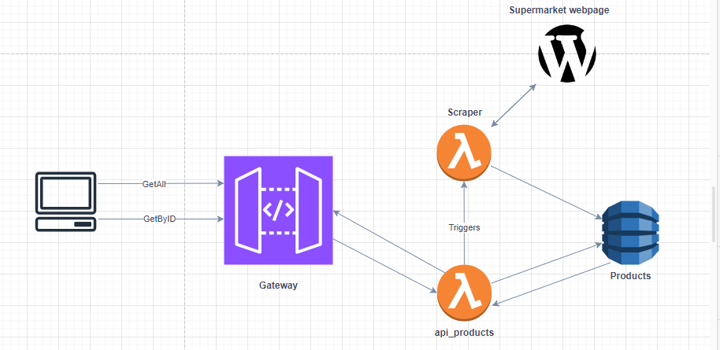

# Serverless Api-Scraper

Serverless API. Scrape data from a supermarket website and store it in a dynamoDB database.

Its a mono-repo with the following structure:

- `api` - Serverless API
- `scraper` - Serverless Scraper
- `shared` - Shared code

The infrastructure is defined using Terraform.


- `[GET] /api/v1/products` - Get all products

```json
{
    "code": 200,
    "status": "OK",
    "message": "Success getting all products",
    "data": [
        {
            "product_id": "uuid",
            "name": "Producto 1",
            "category": "category 1",
            "original_price": 899,
            "discounted_price": 0
        },
        {
            "product_id": "uuid",
            "name": "Producto 2",
            "category": "category 2",
            "original_price": 999,
            "discounted_price": 0
        }
    ]
}
```

- `[GET] /api/v1/products/{ProductID}` - Get a product by ID

```json
{
    "code": 200,
    "status": "OK",
    "message": "Success getting product",
    "data": {
        "product_id": "uuid",
        "name": "Producto 1",
        "category": "category 1",
        "original_price": 899,
        "discounted_price": 0
    }
}
```

- `[POST] /api/v1/products` - Update Data (this will take a while, 1 min aprox)

```json
{
    "update_data" : true
}
```

```json
{
    "code": 200,
    "status": "OK",
    "message": "Success updating data",
    "data": null
}
```

- Use Terraform to deploy the infrastructure.
- Tested with SAM CLI (Serverless Application Model Command Line Interface)