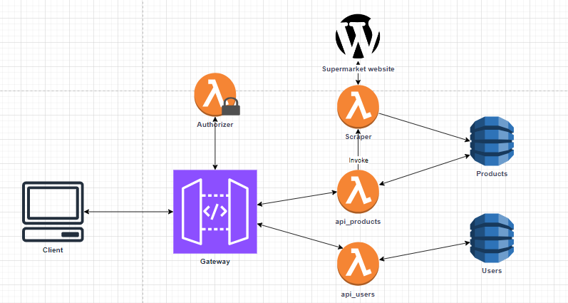

# Serverless Api-Scraper

Serverless API. Scrape data from a supermarket website and store it in a dynamoDB database.

Its a mono-repo with the following structure:

- `api` - Serverless API - Products
- `scraper` - Serverless Scraper
- `shared` - Shared code

The infrastructure is defined using Terraform.

The api lambda is triggered by an API Gateway and the scraper lambda is triggered by the api.

- `[GET] /api/v1/products` - Get all products

```json
{
    "code": 200,
    "status": "OK",
    "message": "Success getting all products",
    "data": [
        {
            "product_id": "uuid",
            "name": "Producto 1",
            "category": "category 1",
            "original_price": 899,
            "discounted_price": 0
        },
        {
            "product_id": "uuid",
            "name": "Producto 2",
            "category": "category 2",
            "original_price": 999,
            "discounted_price": 0
        }
    ]
}
```

- `[GET] /api/v1/products/{ProductID}` - Get a product by ID

```json
{
    "code": 200,
    "status": "OK",
    "message": "Success getting product",
    "data": {
        "product_id": "uuid",
        "name": "Producto 1",
        "category": "category 1",
        "original_price": 899,
        "discounted_price": 0
    }
}
```

- `[POST] /api/v1/products` - Update Data needs a token

```json
{
    "update_data" : true
}
```

```json
{
    "code": 200,
    "status": "OK",
    "message": "Success updating data",
    "data": null
}
```

- `[POST] /api/v1/users` - Register a user

```json
{
    "username": "username",
    "email": "test@tes.com",
    "password": "password",
    "role": "admin"
}
```

```json
{
    "code": 200,
    "status": "OK",
    "message": "Success registering user",
    "data": "User username created successfully ID: uuid"
}
```

- `[POST] /api/v1/users/login` - Login a user

```json
{
    "email": "test@test.com",
    "password": "password"
}
```

```json
{
    "code": 200,
    "status": "OK",
    "message": "Success logging in",
    "data": "token"
}
```

- `[GET] /api/v1/users` - Get all users

```json
{
    "code": 200,
    "status": "OK",
    "message": "Success getting all users",
    "data": [
        {
            "user_id": "uuid",
            "username": "username",
            "email": "test@test.com",
        },
        {
            "user_id": "uuid",
            "username": "username",
            "email": "test1@test.com",
        }
    ]
}
```

## Class Diagram - API Products


## Class Diagram - Scraper


## Class Diagram - API Users

```mermaid
classDiagram
    direction TB

    %% Interfaces
    class UserRepository {
        <<interface>>
        +GetAll() ([]models.User, error)
        +GetByID(id string) (models.User, error)
        +Create(user models.User) (models.User, error)
        +GetByEmail(email string) (models.User, error)
    }

    class UserService {
        <<interface>>
        +RegisterUser(createUserReq request.CreateUserRequest) (models.User, error)
        +GetAllUsers() ([]response.UserResponse, error)
        +GetUserByID(id string) (response.UserResponse, error)
        +LogInUser(logInUserReq request.LogInUserRequest) (response.LogInUserResponse, error)
    }

    class UserController {
        <<interface>>
        +RegisterUser(c *gin.Context)
        +GetAllUsers(c *gin.Context)
        +GetUserByID(c *gin.Context)
        +LogInUser(c *gin.Context)
    }

    %% Implementaciones
    class UserRepositoryImpl {
        -dynamodbiface.DynamoDBAPI db
        -string tableName
        +GetAll() ([]models.User, error)
        +GetByID(id string) (models.User, error)
        +Create(user models.User) (models.User, error)
        +GetByEmail(email string) (models.User, error)
    }

    class UserServiceImpl {
        -UserRepository userRepository
        -*validator.Validate validator
        -utils.PasswordHasher passwordHasher
        -utils.JWTUtils jwtUtils
        +RegisterUser(createUserReq request.CreateUserRequest) (models.User, error)
        +GetAllUsers() ([]response.UserResponse, error)
        +GetUserByID(id string) (response.UserResponse, error)
        +LogInUser(logInUserReq request.LogInUserRequest) (response.LogInUserResponse, error)
    }

    class UserControllerImpl {
        -services.UserService userService
        +RegisterUser(c *gin.Context)
        +GetAllUsers(c *gin.Context)
        +GetUserByID(c *gin.Context)
        +LogInUser(c *gin.Context)
    }

    %% Clases relacionadas
    class User {
        +string UserID
        +string Username
        +string Email
        +string Password
        +string Role
    }

    class CreateUserRequest {
        +string Username
        +string Email
        +string Password
        +string Role
    }

    class LogInUserRequest {
        +string Email
        +string Password
    }

    class UserResponse {
        +string UserID
        +string Username
        +string Email
    }

    class LogInUserResponse {
        +string Token
    }

    class BaseResponse {
        +int Code
        +string Status
        +string Message
        +interface Data
    }

    %% Implementación de Interfaces
    UserRepositoryImpl ..|> UserRepository : implements
    UserServiceImpl ..|> UserService : implements
    UserControllerImpl ..|> UserController : implements

    %% Relaciones entre clases
    UserResponse <|-- BaseResponse : data
    LogInUserResponse <|-- BaseResponse : data
    UserRepositoryImpl o-- User : manages
    UserServiceImpl o-- UserResponse : returns
    UserServiceImpl o-- CreateUserRequest : uses
    UserServiceImpl o-- LogInUserRequest : uses
    UserControllerImpl o-- BaseResponse : returns
```



## Class Diagram - Authorizer


## Interaction Diagram between Lambdas and DynamoDB


## CI/CD Pipeline

